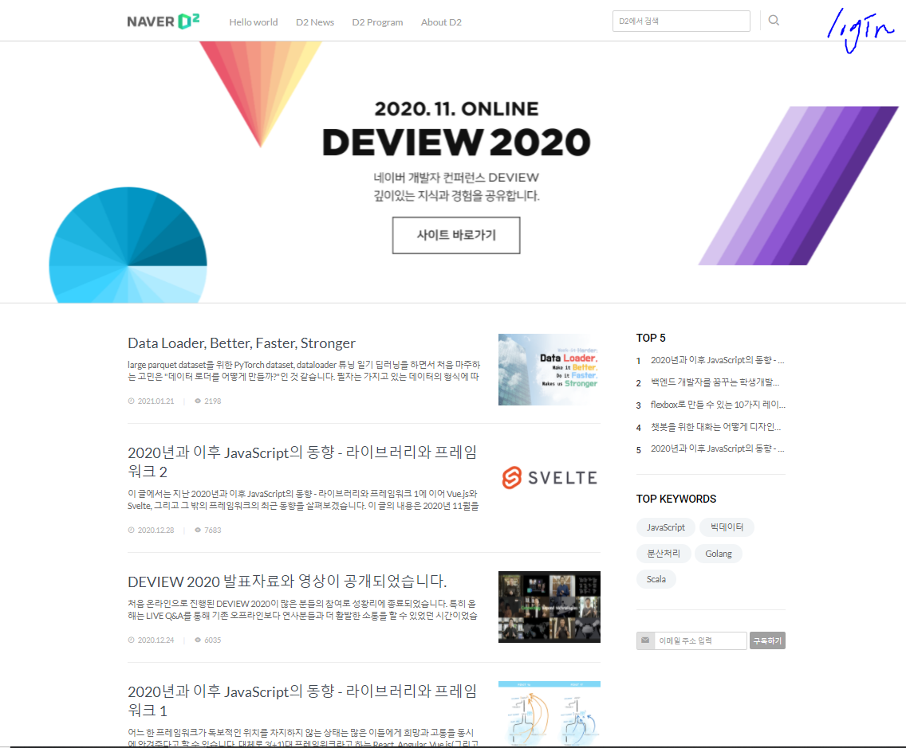
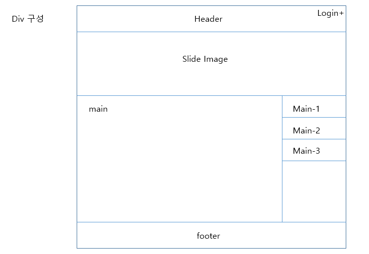

# README

* ### 웹사이트 클론코딩 프로젝트

  시작일: 2021.01.27.

 

* 각자 github user name 으로 된 폴더에서 작업해주세요
* commit log 작업 내용이 잘 드러나도록 작성 바랍니다(단순 날짜, 숫자로 기록 x)

 

* ### 일정

  * 메인 페이지 완성 - 2021.02.01.
  * 로그인 페이지 완성 - 2021.02.03.
  * 커뮤니티 기능 완성 - 1차 발표 - 2021.02.05.
  * 추가 페이지 선정 후 완성 - 최종 발표 - 2021.02.09.

 

* ### 완료된 작업

  * 메인페이지: [merged_main.html](./merged/merged_main.html)

    |                | 진행 | 비고                                          | 담당자                                                       |
    | -------------- | ---- | --------------------------------------------- | ------------------------------------------------------------ |
    | Header, footer | 완료 | 반응형 적용 예정                              | [이동구](https://github.com/LeeDongu)                        |
    | Slide          | 완료 | 디스플레이 에러 수정 예정 반응형 적용 예정 | [오세근](https://github.com/Sekeun)                          |
    | Main           | 완료 |                                               | [윤성환](https://github.com/IncheonYSH)                      |
    | Merge          | 완료 |                                               | [이동구](https://github.com/LeeDongu), [오세근](https://github.com/Sekeun), [윤성환](https://github.com/IncheonYSH) |

     

    

# !TODO

**1. 메인페이지 클론코딩**

   * https://d2.naver.com/home 를 참고한다.

   * 로그인 페이지로 이동하는 object를 상단 바 오른쪽에 따로 추가한다.

     
     
      
     
   * 작업 구역은 다음과 같이 나눈다.

     

     

    

   

**2. 로그인 페이지**

   * https://nid.naver.com/nidlogin.login?mode=form&url=https%3A%2F%2Fwww.naver.com 를 참고한다.

    

**3. 커뮤니티 페이지**

   * 미정

​      

**4.  개인 구현 페이지**

   * 미정

