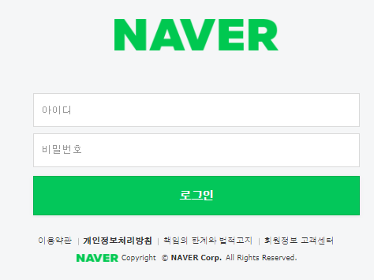

# README

* ### 웹사이트 클론코딩 프로젝트

  시작일: 2021.01.27.

 

* 각자 github user name 으로 된 폴더에서 작업해주세요
* commit log 작업 내용이 잘 드러나도록 작성 바랍니다(단순 날짜, 숫자로 기록 x)

 

* ### 일정

  * 메인 페이지 완성 - 2021.02.01.
  * 로그인 페이지 완성 - 2021.02.03.
  * 커뮤니티 기능 완성 - 1차 발표 - 2021.02.05.
  * 추가 페이지 선정 후 완성 - 최종 발표 - 2021.02.09.

 

* ### 완료된 작업

  * 메인페이지: [merged_main.html](./merged/merged_main.html)(clone of https://d2.naver.com/home)

    |                | 진행 | 비고             | 담당자                                                       |
    | -------------- | ---- | ---------------- | ------------------------------------------------------------ |
    | Header, footer | 완료 | 반응형 적용 예정 | [이동구](https://github.com/LeeDongu)                        |
    | Slide          | 완료 |                  | [오세근](https://github.com/Sekeun)                          |
    | Main           | 완료 |                  | [윤성환](https://github.com/IncheonYSH)                      |
    | Merge          | 완료 |                  | [이동구](https://github.com/LeeDongu), [오세근](https://github.com/Sekeun), [윤성환](https://github.com/IncheonYSH) |

     

# Python 코딩 스타일 가이드

> [Google python style guide](https://google.github.io/styleguide/pyguide.html) 를 참고하였으며
>
>  프로젝트에서 사용하기로 정한 사항입니다.

 

* 전역변수 사용 금지

  물론 전역변수를 사용하여 코딩을 더 쉽게 할 수도 있지만, **사용하지 마십시오**

  꼭 사용하여야 한다면 합의 후 사용하고 주석을 꼼꼼히 달아놓으세요.

   

* 변수 네이밍

  변수 네이밍 방법은 아래와 같이 정합니다.

  | 타입                 | Public               | Internal                          |
  | -------------------- | -------------------- | --------------------------------- |
  | 패키지               | `lower_with_under`   |                                   |
  | 모듈                 | `lower_with_under`   | `_lower_with_under`               |
  | 클래스               | `CapWords`           | `_CapWords`                       |
  | 예외                 | `CapWords`           |                                   |
  | 함수                 | `lower_with_under()` | `_lower_with_under()`             |
  | 글로벌/클래스 상수   | `CAPS_WITH_UNDER`    | `_CAPS_WITH_UNDER`                |
  | 글로벌/클래스 변수   | `lower_with_under`   | `_lower_with_under`               |
  | 인스턴스 변수        | `lower_with_under`   | `_lower_with_under`               |
  | 메서드 이름          | `lower_with_under()` | `_lower_with_under()` (protected) |
  | 함수/메서드 매개변수 | `lower_with_under`   |                                   |
  | 지역 변수            | `lower_with_under`   |                                   |

 

# !TODO

**2. 로그인 페이지**

   * https://nid.naver.com/nidlogin.login?mode=form&url=https%3A%2F%2Fwww.naver.com 를 참고한다.

    

* 각자 프론트 - 백엔드 모두 구현하는 것을 목표로 한다

* 작업 후 각자 결과물에 대하여 리뷰를 진행한다.

   

**3. 커뮤니티 페이지**

   * https://okky.kr/ 참고

​      

**4.  개인 구현 페이지**

   * 미정

